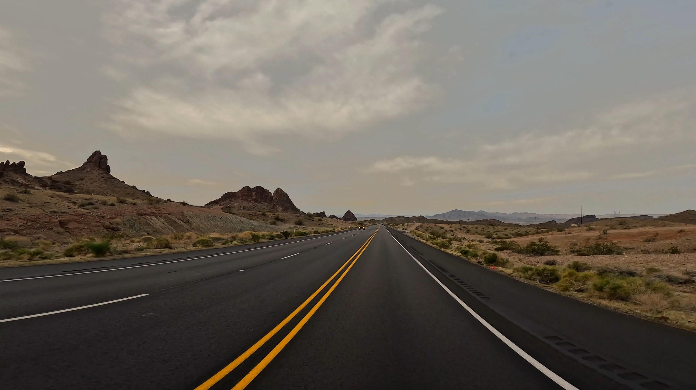
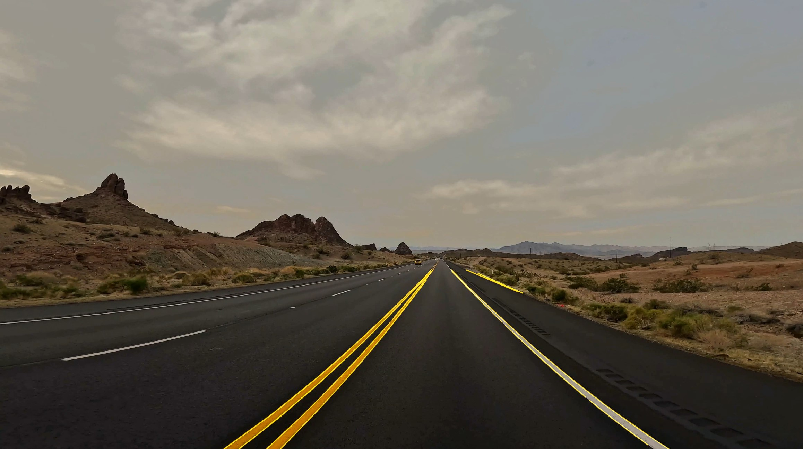

# 🚗 Lane Detection Project

**Simple and efficient lane detection system** using classical computer vision techniques (OpenCV).  
The project processes road videos, detects lane lines, and outputs annotated results.

---

## 🧩 Project structure

lane-detection-project/
│

├─ data/

│ ├─ input/ # Input videos (e.g. dashcam footage)

│ └─ output/ # Processed videos with lane overlay

│

├─ src/

│ └─ lane_detector.py # Main processing script

│

├─ requirements.txt

└─ README.md

---

## ⚙️ Installation

1. Clone the repository:
   ```bash
   git clone https://github.com/YOUR_USERNAME/lane-detection-project.git
   cd lane-detection-project
   
2. Create a virtual environment (recommended):
    ```bash
       python -m venv venv
       source venv/bin/activate      # macOS/Linux
       venv\Scripts\activate         # Windows
   
3. Install dependencies::
    ```bash
       pip install -r requirements.txt

---

## ▶️ Usage

**Option 1 — Run directly (PyCharm or VSCode)**

Simply press Run on src/lane_detector.py.
It will automatically process all videos in data/input/ and save the results to data/output/.

---

**Option 2 — Run via CLI**

You can also use the command line interface:

```bash
   python -m src.lane_detector --input_dir data/input --output_dir data/output
```

If you want to overwrite existing processed videos:

```bash
   python -m src.lane_detector --input_dir data/input --output_dir data/output --overwrite
```

You can specify any folders:
```bash
  python -m src.lane_detector --input_dir R:\Videos --output_dir R:\Processed
```

### ⚙️ Optional parameters for fine-tuning

**You can customize detection and ROI shape using extra arguments:**
```markdown
| Argument | Default | Description |
|-----------|----------|-------------|
| `--roi-top` | 0.60 | Vertical position of the trapezoid top (0..1). Larger = lower horizon. |
| `--roi-top-width` | 0.20 | Relative trapezoid width at the top (0..1). |
| `--roi-bottom-width` | 1.00 | Relative trapezoid width at the bottom. |
| `--min-angle-deg` | 20.0 | Ignore almost horizontal lines below this angle. |
| `--canny-low` / `--canny-high` | 80 / 160 | Canny edge detection thresholds. |
```

## 🧠 How it works

1. **Region of Interest (ROI)** — Only the lower portion of the frame (road area) is analyzed.

2. **Preprocessing** — Gaussian blur + Canny edge detection for edge extraction.

3. **Hough Transform (cv2.HoughLinesP)** — Detects straight lines in the ROI.

4. **Filtering** — Removes nearly horizontal lines to keep lane markings only.

5. **Visualization** — Draws the lane lines on top of the original frame and saves the video.

## 🧾 Example output
Example video: https://www.pexels.com/video/a-car-driving-down-a-highway-in-the-desert-28388451/

| Input frame                    | Processed frame                       |
|--------------------------------|---------------------------------------|
|  |  |


## 📊 Console logs example

```yaml
[INFO] No CLI args detected. Using defaults: --input_dir data/input --output_dir data/output

[INFO] Found 2 file(s). Output dir: data/output

[START] highway.mp4  | 1920x1080 @ 30.0fps | frames: 450
  - highway.mp4: 100/450 (22.2%)
  - highway.mp4: 200/450 (44.4%)
  - highway.mp4: 300/450 (66.6%)
  - highway.mp4: 400/450 (88.8%)
[DONE] highway.mp4 -> highway_lanes.mp4 | written 450 frames

```

## 🧰 Requirements

- Python 3.10+

- OpenCV ≥ 4.8

- NumPy ≥ 1.24

**Example:**

```bash
  pip install opencv-python numpy
```

## 📜 License

This project is released under the MIT License — you are free to use, modify, and distribute it.

## 👤 Author

**Andrii Kazantsev**